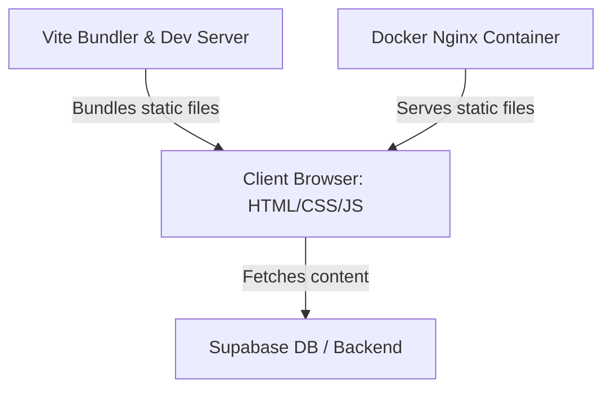
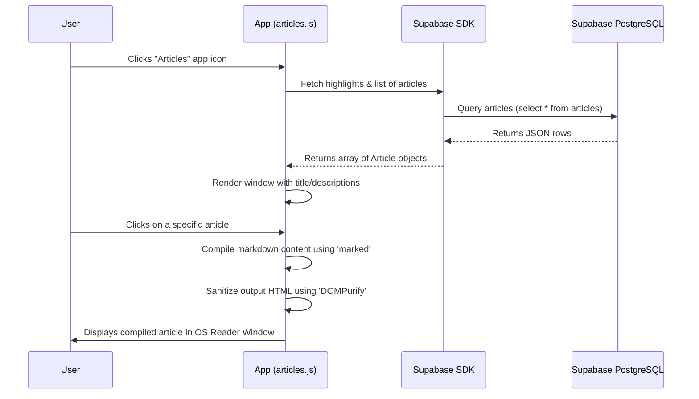

# System Architecture - Francis's Portfolio OS

This document outlines the architecture, data flow, and components of Francis's Portfolio OS, an interactive, desktop-OS themed personal website.

---

## Component Overview

The application is built as a lightweight, single-page application (SPA) with a static frontend and a serverless backend.

### 1. Frontend Client
- **Core:** Vanilla HTML5, CSS3 (using CSS custom variables for theming), and ES6+ JavaScript.
- **Window Manager:** A custom JavaScript-based window manager that manages absolute-positioned floating windows, handles focus ordering (z-index), and implements mouse drag-and-drop mechanics. It automatically centers windows and constrains their dimensions (`safeW` / `safeH`) based on current client viewport boundaries (`window.innerWidth` and `window.innerHeight`) on window creation and re-opening to ensure usability on smaller screens.
- **Third-Party Libraries:**
  - `marked`: Parses article contents written in Markdown into structured HTML on-the-fly.
  - `dompurify`: Sanitizes generated HTML to prevent XSS (Cross-Site Scripting) injection from database-fetched articles.
  - `@supabase/supabase-js`: Client SDK to interact with the Supabase project.

### 2. Database Backend (Supabase)
- **Engine:** PostgreSQL.
- **Table Schema:** [articles](file:///c:/Users/MSI/Desktop/Projects/Portfolio%20Website/supabase_setup.sql)
  - `id` (uuid, primary key)
  - `title` (text, not null)
  - `description` (text)
  - `content_md` (text, not null)
  - `img` (text)
  - `tags` (text[])
  - `is_highlight` (boolean)
  - `created_at` (timestamp)
- **Security:** Row Level Security (RLS) is enabled.
  - Public read access is allowed.
  - Admin (insert, update, delete) requires authentication.

### 3. Deployment & Infrastructure
- **Development Server:** Vite dev server.
- **Production Server:** Serves static files from an [nginx:alpine](file:///c:/Users/MSI/Desktop/Projects/Portfolio%20Website/Dockerfile) container exposing port `80`.

---

## Data Flow (Article Fetching)

