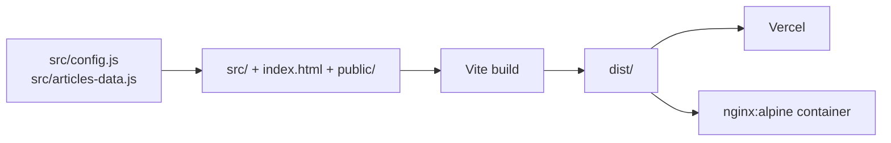
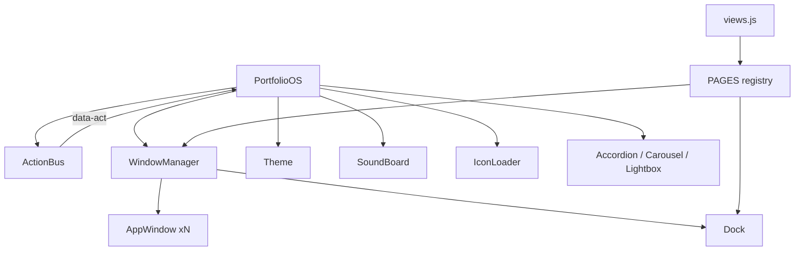
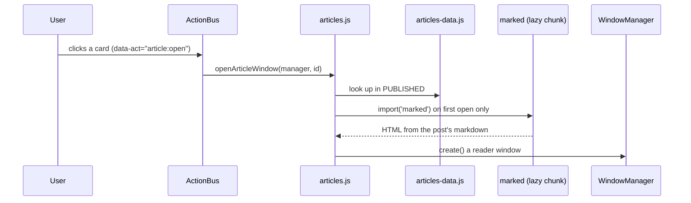
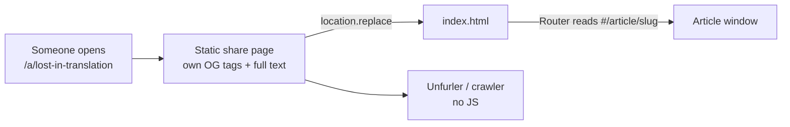

# System Architecture — Portfolio OS

A single-page, fully static site. All content is bundled at build time; there is
no backend to call at runtime.

---

## Build and serve

```mermaid
graph LR
    Content[src/config.js<br/>src/articles-data.js]
    Src[src/ + index.html + public/]
    Vite[Vite build]
    Dist[dist/]
    Vercel[Vercel]
    Nginx[nginx:alpine container]

    Content --> Src
    Src --> Vite
    Vite --> Dist
    Dist --> Vercel
    Dist --> Nginx
```

---

## Runtime composition

`PortfolioOS` (`src/app.js`) owns one instance of each collaborator and nothing
else holds global state.

```mermaid
graph TD
    OS[PortfolioOS]
    Bus[ActionBus]
    WM[WindowManager]
    Win[AppWindow xN]
    Dock[Dock]
    Theme[Theme]
    Sound[SoundBoard]
    Icons[IconLoader]
    Misc[Accordion / Carousel / Lightbox]
    Pages[PAGES registry]
    Views[views.js]

    OS --> Bus
    OS --> WM
    OS --> Theme
    OS --> Sound
    OS --> Icons
    OS --> Misc
    WM --> Win
    WM --> Dock
    Pages --> WM
    Pages --> Dock
    Views --> Pages
    Bus -->|data-act| OS
```

- **ActionBus** listens once on `document` for `click` and for `Enter`/`Space` on
  non-native controls, resolves `closest('[data-act]')`, and calls the registered
  handler with that element's dataset. Windows created later — articles, the two
  easter eggs — are interactive without any extra binding.
- **WindowManager** owns the `AppWindow` map, the z-order (renormalised before it
  can reach the fixed top controls), the snap ghost, and the tab title / meta
  description, which follow whichever window is focused.
- **AppWindow** owns its own geometry, pointer drag, resize handle and snap state.
  Pointer events cover mouse and touch with one code path.
- **Dock** subscribes to the manager and re-syncs its lit dots whenever a window
  opens or is put away.

---

## The window registry

`src/windows.js` exports `PAGES`. Each entry carries `id`, `icon`, `width`,
`height`, `description`, an `inHome` flag and a `render` function. From that one
list come the windows, the dock buttons, the home-screen shortcuts, the tab
titles and the meta descriptions. Adding a section is one object.

---

## Opening an article

```mermaid
sequenceDiagram
    participant User
    participant Bus as ActionBus
    participant Art as articles.js
    participant Data as articles-data.js
    participant Marked as marked (lazy chunk)
    participant WM as WindowManager

    User->>Bus: clicks a card (data-act="article:open")
    Bus->>Art: openArticleWindow(manager, id)
    Art->>Data: look up in PUBLISHED
    Art->>Marked: import('marked') on first open only
    Marked-->>Art: HTML from the post's markdown
    Art->>WM: create() a reader window
```

---

## Deep links and sharing

Every window is addressable. `src/ui/router.js` maps the hash to a window and
back again — `#/` for home, `#/projects` for a section, `#/article/<slug>` for
a post. `WindowManager.onRoute` fires on focus and on stow, so the address bar
follows whatever is on top; focus replaces the entry, an explicit open pushes
one, so the back button walks the windows a visitor actually opened.

A hash alone is not shareable, though — no unfurler reads one, and none of them
run the JS behind it. So the Vite build emits one static page per published
post at `/a/<slug>/`:

```mermaid
graph LR
    Visitor[Someone opens<br/>/a/lost-in-translation]
    Page[Static share page<br/>own OG tags + full text]
    App[index.html]
    Win[Article window]
    Bot[Unfurler / crawler<br/>no JS]

    Visitor --> Page
    Page -->|location.replace| App
    App -->|Router reads #/article/slug| Win
    Page --> Bot
```

The plugin lives in `vite.config.js` and also rewrites `sitemap.xml` so each
post is listed. The copy-link button in an article window hands out the
`/a/<slug>` form, not the hash.

---

## Code splitting

`marked`, `game.js` and `crossword.js` are dynamic imports, so none of them are
in the entry chunk. The two easter eggs are only fetched by someone who finds
them.
