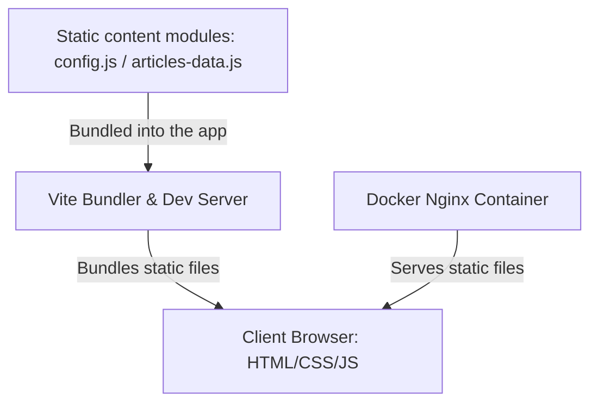
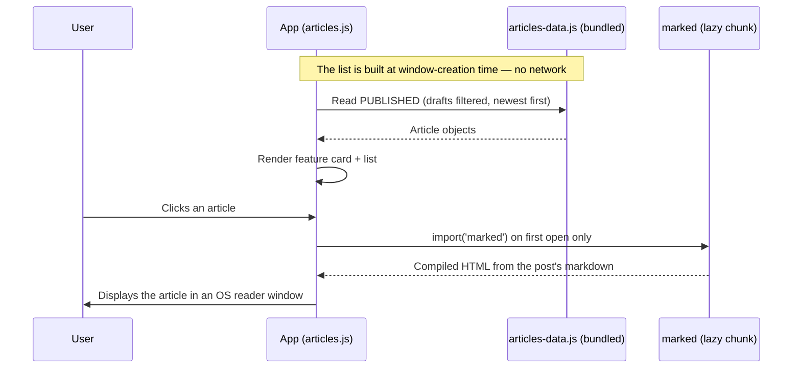

# System Architecture - Francis's Portfolio OS

This document outlines the architecture, data flow, and components of Francis's Portfolio OS, an interactive, desktop-OS themed personal website.

---

## Component Overview

The application is built as a lightweight, single-page application (SPA). It is fully static — all content is bundled at build time and there is no backend to call at runtime.

```mermaid
graph TD
    Client[Client Browser: HTML/CSS/JS]
    Content[Static content modules: config.js / articles-data.js]
    Vite[Vite Bundler & Dev Server]
    Nginx[Docker Nginx Container]

    Content -->|Bundled into the app| Vite
    Vite -->|Bundles static files| Client
    Nginx -->|Serves static files| Client
```

### 1. Frontend Client
- **Core:** Vanilla HTML5, CSS3 (using CSS custom variables for theming), and ES6+ JavaScript.
- **Window Manager:** A custom JavaScript-based window manager that manages absolute-positioned floating windows, handles focus ordering (z-index), and implements mouse drag-and-drop mechanics. It automatically centers windows and constrains their dimensions (`safeW` / `safeH`) based on current client viewport boundaries (`window.innerWidth` and `window.innerHeight`) on window creation and re-opening to ensure usability on smaller screens.
- **Third-Party Libraries:**
  - `marked`: Parses article markdown into HTML when a post is opened. Code-split, so it is not on the critical path.

### 2. Content
All content is authored as ES modules and bundled at build time.

- `src/config.js` — site copy: bio, education, interests, skills, projects, gallery, career, faq, links.
- `src/articles-data.js` — the article set. Each entry:
  - `id` (slug, used for the article window id)
  - `title`, `description`
  - `date` (ISO; drives sort order and the byline)
  - `tags` (string[]), `img` (optional)
  - `highlight` (the post featured at the top of the window)
  - `draft` (excluded from the site entirely)
  - `body` (markdown)

  The module exports `PUBLISHED`, which filters out drafts and empty bodies and
  sorts newest-first — one place enforces what is publicly visible.

### 3. Deployment & Infrastructure
- **Development Server:** Vite dev server.
- **Production Server:** Serves static files from an [nginx:alpine](file:///c:/Users/MSI/Desktop/Projects/Portfolio%20Website/Dockerfile) container exposing port `80`.

---

## Data Flow (Opening an Article)

```mermaid
sequenceDiagram
    participant User
    participant App as App (articles.js)
    participant Data as articles-data.js (bundled)
    participant Marked as marked (lazy chunk)

    Note over App,Data: The list is built at window-creation time — no network
    App->>Data: Read PUBLISHED (drafts filtered, newest first)
    Data-->>App: Article objects
    App->>App: Render feature card + list
    User->>App: Clicks an article
    App->>Marked: import('marked') on first open only
    Marked-->>App: Compiled HTML from the post's markdown
    App->>User: Displays the article in an OS reader window
```
